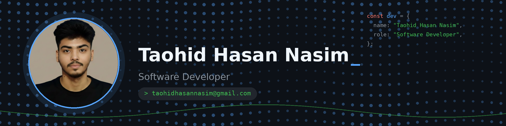

# Hey there, I'm Taohid Hasan Nasim 👋

### Software Developer | Turning ideas into pixels ✨

## 🙋 About Me

I'm a developer who loves turning coffee and curiosity into clean, responsive web experiences. I enjoy building things that look good, feel smooth, and actually help people. Always learning, always shipping.

## ⚡ What I'm Up To

- 🔭 Building a tourism website that makes trip planning effortless
- 🌱 Exploring Next.js and its magic
- 🎯 Sharpening my skills, one commit at a time
- 💬 Ask me about React, Tailwind, or great UI

## 📍 Find Me

- Location: Dhaka, Bangladesh
- Email: taohidhasannasim@gmail.com

## 🧰 My Toolbox

## 🌐 Let's Connect

## 📊 My GitHub Journey

 

*"Code is like humor. When you have to explain it, it's bad."* 😄
